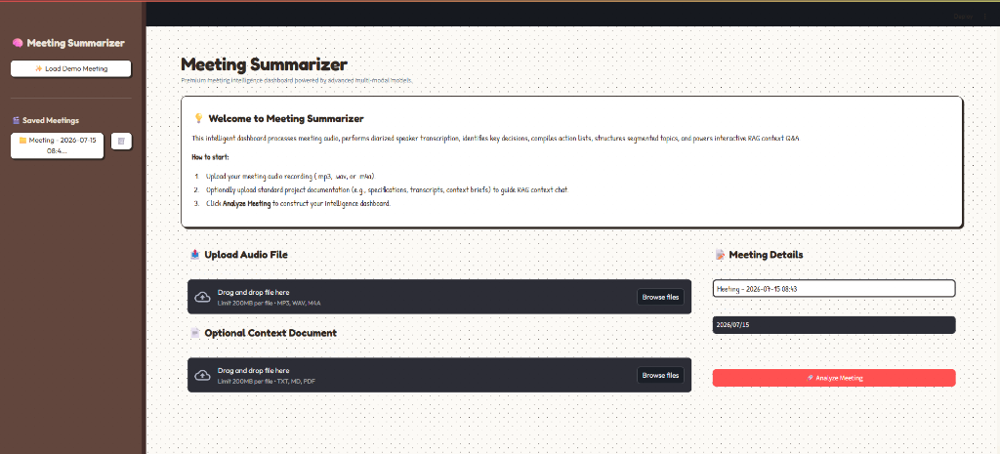
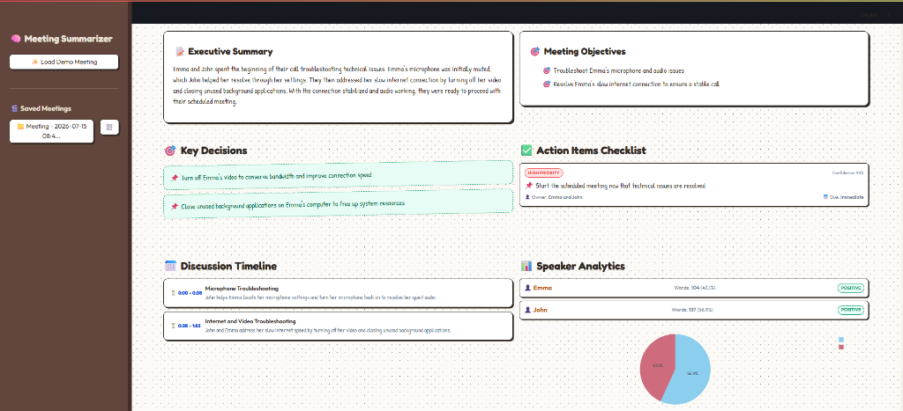

# 🧠 Meeting Summarizer

An advanced, high-performance meeting intelligence dashboard that transcribes meeting audio and extracts structured insights, including executive summaries, objectives, key decisions, action-oriented checklists, a discussion timeline, speaker metrics, and an interactive RAG (Retrieval-Augmented Generation) chat assistant.

## 📸 Visual Interface

### 📤 Upload & Initialization Screen


### 📊 Dashboard Analysis & Speaker Metrics


---

## ✨ Key Features

1. **Audio Transcription & Diarization**: Multi-model support using:
   - **Google Gemini** (Native multi-modal audio processing for transcription, diarization, and structured reasoning in a single pass).
   - **OpenAI Whisper + GPT-4o** (Whisper for timestamped transcription, and GPT-4o for speaker reconstruction and structured parsing).
2. **Comprehensive Meeting Intelligence Extraction**:
   - **Executive Summary**: A concise 3-5 sentence synopsis.
   - **Core Objectives**: Bulleted key targets.
   - **Key Decisions**: Extracted design, architecture, or business alignments.
   - **Action Items Checklist**: Concrete task lists assigned to specific owners with priority ranks, due dates, and confidence scoring.
   - **Discussion Timeline**: Timestamps matching dialogue topic transitions.
   - **Speaker Analytics**: Speaking share distributions, word counts, and speaker-level sentiment analysis with interactive Plotly visualizer charts.
3. **Interactive RAG Chat (Ask AI)**: Chat interface that allows querying the meeting transcript and referencing external documents (specs, agendas, briefs) directly from the dashboard context.
4. **Persistent Local Database**: Uses SQLite to persist audio paths, transcript entries, analysis schemas, and context text.
5. **Polished Neobrutalist UI**: A beautiful, paper-themed brown book binder Streamlit dashboard styled with Google Fonts (Outfit, Fredoka, Patrick Hand) and rotated paper sticker visuals.

---

## 🛠️ Technology Stack

* **Frontend Dashboard**: [Streamlit](https://streamlit.io/) (custom CSS injections for glassmorphism/neobrutalism)
* **AI Engine & Models**: Google Generative AI (`gemini-3.5-flash` / `gemini-1.5-pro`) & OpenAI (`whisper-1` + `gpt-4o`)
* **Persistence Layer**: SQLite (`database.py`)
* **Visualization Charts**: Plotly Express
* **Audio Processing Utilities**: Mutagen (for duration estimation)

---

## 🚀 Quick Start & Installation

### 1. Prerequisites
Ensure you have **Python 3.9+** installed on your system.

### 2. Install Dependencies
Clone the repository and install requirements:
```bash
pip install -r requirements.txt
```
*(All required libraries: Streamlit, Google Generative AI, OpenAI, Plotly, Pandas, PyPDF, Mutagen, and ReportLab are listed in `requirements.txt`.)*

### 3. API Configuration
Create a `.env` file in the root directory:
```env
GEMINI_API_KEY=your-gemini-api-key-here
OPENAI_API_KEY=your-openai-api-key-here
```
> **Note**: A key is required for live audio processing. If you do not configure an API key, the application will default to **Demo Mode**, letting you evaluate the complete interface using preloaded kickoff transcripts and analysis data.

### 4. Running the Application
Run the Streamlit application using the command line:
```bash
streamlit run app.py
```
Or, on Windows, simply double-click the helper script:
```bash
run.bat
```

---

## 📖 How to Use

1. **Dashboard Home**: On launching, click **✨ Load Demo Meeting** in the sidebar. This loads a sample product planning session containing transcripts, analytics, timelines, and chat metrics.
2. **Uploading Meetings**:
   - Upload meeting audio (`.mp3`, `.wav`, or `.m4a`).
   - (Optional) Upload a PDF, Markdown, or Text spec sheet/brief as a **Context Document**.
   - Input a title and date, then select **🚀 Analyze Meeting** to run the pipeline.
3. **Visualizing Insights**:
   - Navigate the **📊 Dashboard Overview** tab to view the summary, objectives, sticker notes for decisions, and the action items checklist.
   - Interact with the **Discussion Timeline** and view speaking distribution share charts under **Speaker Analytics**.
4. **Dialogue Search**:
   - Under the **💬 Dialogue Transcript** tab, scroll through speaker-tagged dialogue bubbles.
   - Use the text search input to locate specific discussions; matches will highlight dynamically.
5. **Asking Questions (RAG Chat)**:
   - Click the **🤖 Ask AI (RAG Chat)** tab.
   - Type questions like *"What did David say about the database schema?"* or *"When is the MVP deadline?"* to query the meeting transcript and context documents.

---

## 📂 Project Structure

```text
├── app.py            # Streamlit dashboard layout, CSS styles, and tabs rendering
├── pipeline.py       # Pydantic schemas, ASR/LLM pipelines, and RAG chat execution
├── database.py       # SQLite connection helper, database initialization, and CRUD operations
├── requirements.txt  # Python packages list
├── run.bat           # Quick launcher script for Windows
├── uploads/          # Local directory storing uploaded audio files
└── meetings.db       # Persistent SQLite database file
```
